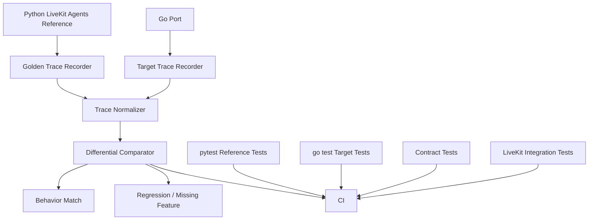

# AGENTS.md

## Project Mission

`rtp-agent` is a Go implementation effort for LiveKit Agents-style runtime behavior.

The project goal is not a line-by-line translation of the Python project. The goal is to build a production-grade Go runtime that mirrors the useful behavior of LiveKit Agents where it matters: worker lifecycle, job dispatch, agent/session/activity orchestration, streaming model boundaries, tools, interruption handling, room I/O, telemetry, and provider integrations.

Use `refs/agents/livekit-agents` as the behavioral reference.

Success is measured by **behavioral parity**, not symbol coverage. A Go type, function, or package with the same name as the Python reference is only a candidate. It becomes useful only when it is wired into real product flow and validated by the correct test layer.

The repository already has a parity gate system. Use it. Do not replace it with new ad hoc runners or new case-file formats.

The central parity source of truth is:

```text
scripts/parity-fixtures/test-cases.tsv
```

The manifest is TSV, and embedded JSON belongs in TSV fields such as `input_json`. Keep it that way. Do not split parity cases into separate JSON files just because JSON is easier to edit in isolation.

Read:

- `README.md` for project purpose, setup, and CLI usage.
- `ARCHITECTURE.md` for layer boundaries and dependency direction.
- `.go-arch-lint.yml` for enforced dependency rules.
- `scripts/parity-fixtures/test-cases.tsv` for parity cases.
- `scripts/parity-gate.sh` for the repo’s parity-sensitive quality gate.
- `scripts/parity-validate.sh` for manifest execution semantics.
- `refs/agents/livekit-agents` for the Python behavioral reference.

## Core Operating Principles

1. **Behavior first.** Mirror runtime behavior, lifecycle semantics, contracts, event ordering, error handling, and observable outputs before chasing symbol counts.
2. **Manifest first.** Add or update rows in `scripts/parity-fixtures/test-cases.tsv` before creating new parity runners.
3. **TSV stays TSV.** Keep parity case JSON embedded in the TSV manifest. Do not introduce per-case runner unless an existing runner explicitly requires that and the case cannot be represented safely in `input_json`.
4. **Native tests first.** Use `pytest` for Python reference behavior and `go test` for Go implementation behavior. Do not invent a universal runner that weakens both ecosystems.
5. **Contracts over screenshots.** For parity-sensitive behavior, compare normalized JSON, traces, schemas, state transitions, events, or explicit contracts.
6. **Integration where needed.** Use Testcontainers or local services when behavior depends on LiveKit server, Redis, databases, queues, SIP/telephony support, provider-like dependencies, or cross-process runtime behavior.
7. **No fake progress.** Do not add inert ports, unused adapters, fake references, skipped tests, weakened assertions, or dead code.
8. **No runner sprawl.** The parity runner system must not keep growing for every behavior gap. Extend `parity-validate.sh` only when a new general case type is needed.
9. **Provider boundaries matter.** Keep `core` provider-agnostic. Provider-specific API details belong in `adapter/<provider>`.
10. **Architecture rules are product rules.** Do not work around `.go-arch-lint.yml`; fix package boundaries instead.
11. **Reference code is read-only.** Do not edit `refs/agents/*` except when explicitly updating vendored reference material.
12. **CI must explain failures.** Tests and parity runners should emit useful machine-readable output, especially normalized traces and JUnit XML reports where practical.

## Current Parity System

The repository already has a parity gate architecture. Treat it as the canonical project workflow.

### Main entrypoint

```sh
scripts/parity-gate.sh
```

`parity-gate.sh` is the repo’s parity-sensitive quality gate. It is not merely “run all Go tests.”

For optimum working cycle time per slice `scripts/parity-gate.sh --local` are encouraged.

It performs, in order:

1. Shell syntax checks for parity and quality scripts.
2. Manifest-driven parity validation via `scripts/parity-validate.sh`.
3. Staged test-integrity checks via `scripts/check-test-integrity.sh`.
4. Staged Go analyzer/deadcode checks via `scripts/check-deadcode.sh`, unless `--quick`.

### Manifest

The parity manifest is:

```text
scripts/parity-fixtures/test-cases.tsv
```

The manifest schema is:

```text
case_name, type, source_ref, target_ref, go_package, go_test, python_runner, go_runner, input_json, contract, behavior, notes
```

Rules:

- The manifest is TSV.
- Keep embedded JSON inside TSV fields, especially `input_json`.
- Do not create separate JSON case files as a default pattern.
- Do not move the manifest to JSON/YAML.
- Do not add new manifest columns without updating script self-tests.
- Do not add tabs inside fields.
- Prefer one manifest row per meaningful behavior contract.
- Do not blindly add every Go test to the manifest. Use `scripts/parity-test-inventory.sh` as an inventory aid, not an auto-enrollment tool.

Current manifest reality:

- Most cases are `go-test`.
- A smaller number are true `cross-runtime`.
- There may be a small number of `symbol-report` cases.

Interpretation:

- `go-test` is valid parity evidence only when the Go test intentionally encodes Python reference behavior.
- `cross-runtime` is the strongest available parity proof because it runs Python and Go side by side.
- `symbol-report` is inventory validation, not behavioral parity.

## Behavior Parity Pipeline

The project’s target parity architecture is:



This diagram must be implemented through the existing TSV manifest and parity scripts, not by creating one runner per case.

### Node responsibilities

| Diagram node | Repository interpretation |
|---|---|
| Python LiveKit Agents Reference | `refs/agents/livekit-agents` |
| Golden Trace Recorder | `python_runner` from a `cross-runtime` TSV row |
| Go Port | current Go implementation |
| Target Trace Recorder | `go_runner` from a `cross-runtime` TSV row |
| Trace Normalizer | normalization inside `parity-validate.sh` or shared normalization helpers |
| Differential Comparator | JSON sorting, normalization, and diff in `parity-validate.sh` |
| pytest Reference Tests | Python reference runners or pytest-based reference tests |
| go test Target Tests | `go-test` TSV rows batched by `parity-validate.sh` |
| Contract Tests | `contract` field plus Go tests, cross-runtime JSON contracts, or schema/golden checks |
| LiveKit Integration Tests | Go tests or manifest cases that start local services/Testcontainers |
| CI | `parity-gate.sh`, Go test workflows, and CI report generation |

### Required cross-runtime contract

For `cross-runtime` cases:

- `input_json` is embedded in the TSV row.
- `parity-validate.sh` materializes `input_json` as a temporary input file.
- `python_runner input.json` must run the Python reference side.
- `go_runner input.json` must run the Go target side.
- Both runners must emit JSON shaped like:

```json
{"contract":"...", "events":[...]}
```

The output must be normalized and compared at contract level.

Do not create new standalone JSON fixture files for ordinary `cross-runtime` cases. The TSV row is the case.

## Parity Case Types

`parity-validate.sh` understands these case types.

### `go-test`

A `go-test` case:

- reads `go_package` and `go_test` from the TSV manifest
- batches selected tests in the same package into one `go test`
- runs:

```sh
go test "$go_package" -run "^($regex)$" -count=1 -v
```

It then normalizes duration, whitespace, temporary paths, timestamps, and UUIDs.

It asserts the verbose output contains:

```text
=== RUN TestName
--- PASS: TestName (<duration>)
PASS
ok package <duration>
```

Important limitation:

`go-test` proves the Go regression test passes and is manifest-linked to a reference file. It does **not** execute Python.

Use `go-test` when:

- the behavior is already understood from the Python reference
- a Go test clearly encodes that behavior
- true cross-runtime execution would be too expensive or impractical
- the manifest row includes useful `source_ref`, `target_ref`, `contract`, `behavior`, and `notes`

### `cross-runtime`

A `cross-runtime` case:

- materializes `input_json` from the TSV row
- runs `python_runner input.json`
- runs `go_runner input.json`
- requires both outputs to be JSON shaped like:

```json
{"contract":"...", "events":[...]}
```

It sorts JSON keys, normalizes unstable values, and diffs Python vs Go output.

This is the strongest parity proof in the current script system.

Use `cross-runtime` when:

- both Python and Go sides can execute deterministically
- behavior is important enough to compare directly
- output can be expressed as normalized JSON events
- the input scenario fits safely in the TSV `input_json` field

### `symbol-report`

A `symbol-report` case:

- uses `scripts/parity-check.sh`
- compares symbol inventory against a golden fixture
- validates Layer 1 coverage/inventory only

Important limitation:

`symbol-report` is not behavioral parity. Do not treat it as proof that Go behavior matches Python behavior.

## Runner Sprawl Policy

Parity runners must not grow without discipline.

Default rule:

```text
Add a TSV manifest row. Do not add a new runner.
```

Create or modify a runner only when:

- the behavior cannot be represented by an existing `go-test`, `cross-runtime`, or `symbol-report` case
- the runner is reusable for a class of behavior, not one test only
- the runner accepts the standard materialized `input_json` path when used by `cross-runtime`
- the runner emits the standard JSON output shape when used by `cross-runtime`
- script self-tests are updated
- the manifest row documents the runner path and contract

Do not create:

- one runner per case
- one JSON fixture file per case
- one shell wrapper per behavior when `go-test` can run it
- one Python script per trivial reference assertion
- ad hoc output formats that `parity-validate.sh` cannot normalize

If a runner is growing too broad, prefer adding mode/contract handling to an existing reusable runner rather than creating another near-duplicate runner.

## Testing Philosophy

This project follows a layered testing model.

Do not search for a single universal test framework for both Go and Python. Preserve language-native ergonomics and standardize only orchestration, contracts, integration scenarios, and reporting.

Use the following layers:

| Layer | Purpose | Preferred tools |
|---|---|---|
| Python reference tests | Understand and capture LiveKit Agents behavior | `pytest`, reference runners, golden trace capture |
| Go unit tests | Validate pure Go logic and package behavior | Go `testing`, `go test` |
| Contract tests | Validate stable JSON/protobuf/session/tool-call/event shapes | TSV `contract` field, Go tests, golden JSON emitted by runners |
| Cross-runtime parity tests | Prove Python reference and Go implementation behave the same | `cross-runtime` TSV rows, normalized JSON events, `parity-validate.sh` |
| Integration tests | Validate runtime dependencies and process/service behavior | Testcontainers, local LiveKit server, Docker services |
| CI reporting | Provide shared reporting across Python and Go | `pytest --junit-xml`, `gotestsum --junitfile` |
| Static quality gates | Prevent broken or inert code | `go-arch-lint`, `staticcheck`, `deadcode`, test-integrity scripts |

A passing Go unit test is not enough for parity-sensitive behavior. Important LiveKit-reference behavior should be validated at the narrowest layer that proves the contract: unit test, contract test, cross-runtime parity test, or integration test.

Do not use heavy integration tests where a unit test proves the behavior. Do not rely only on unit tests where the risk is cross-runtime drift, service-boundary drift, lifecycle drift, or event-order drift.

## Reference-To-Go Map

Use this map when deciding where reference behavior belongs.

| LiveKit Python reference | Go destination |
|---|---|
| `livekit/agents/worker.py`, `job.py` | `interface/worker` |
| `livekit/agents/ipc/*` | `interface/worker/ipc` |
| `livekit/agents/cli/*` | `interface/cli` |
| `livekit/agents/voice/agent.py` | `core/agent/agent.go` |
| `livekit/agents/voice/agent_session.py` | `core/agent/agent_session.go` |
| `livekit/agents/voice/agent_activity.py` | `core/agent/agent_activity.go` |
| `livekit/agents/voice/generation.py` | `core/agent/generation.go` |
| `livekit/agents/voice/room_io/*` | `interface/worker/room_io.go` |
| `livekit/agents/voice/recorder_io/*` | `interface/worker/recorder_io.go` |
| `livekit/agents/voice/transcription/*` | `core/agent/transcription.go` |
| `livekit/agents/voice/avatar/*` | `core/agent/avatar.go` plus provider adapters |
| `livekit/agents/voice/ivr/*` | `core/agent/ivr.go` and `core/beta/tools` |
| `livekit/agents/llm/*` | `core/llm` |
| `livekit/agents/stt/*` | `core/stt` |
| `livekit/agents/tts/*` | `core/tts` |
| `livekit/agents/vad.py` | `core/vad` |
| `livekit/agents/inference/*` | `adapter/livekit` for compatibility shims |
| `livekit/agents/evals/*` | `core/evals` |
| `livekit/agents/metrics/*`, `telemetry/*` | `library/telemetry` |
| `livekit/agents/tokenize/*` | `library/tokenize` |
| `livekit/agents/utils/*` | `library/utils` or a narrower existing package |
| `livekit-plugins/*` | `adapter/<provider>` |

If the map is incomplete or stale, do not guess silently. State the reference files, target files, and intended package boundary before implementing.

## Porting Rules

- Start from the Python reference behavior, then implement or adjust the Go behavior in the mapped package.
- Preserve lifecycle semantics where practical: worker, job context, agent, session, activity, tools, streaming LLM/STT/TTS, VAD, interruption, room I/O, telemetry, and provider boundaries.
- Prefer small Go interfaces around stable behavior over direct translations of Python inheritance patterns.
- Do not translate Python control flow mechanically when Go needs a clearer design. Preserve behavior and contracts, not Python syntax.
- Keep `core` provider-agnostic.
- Keep provider-specific API details in `adapter/<provider>`.
- Keep LiveKit transport, room connection, worker protocol, dispatch, and runtime process concerns in `interface/worker`.
- Keep CLI parsing and local developer commands in `interface/cli`.
- Keep shared reusable helpers in `library/*`, but avoid dumping unrelated utilities into broad packages.
- Do not add cross-layer imports that violate `.go-arch-lint.yml`.
- Do not edit `refs/agents/*` except when explicitly updating vendored reference material.
- Do not leave new dead code behind. New functionality must be wired into real product flow, tests, registry, factory, config, interface, or composition roots.
- Do not create fake call sites solely to silence `deadcode`.

## Functionality Mirroring Workflow

For each parity task:

1. Inspect the matching Python reference under `refs/agents/livekit-agents`.
2. Inspect the existing Go package and tests.
3. Identify the behavior to mirror, not only the symbol or file to port.
4. Choose the right test layer:
   - Go unit test
   - Python reference runner
   - contract test
   - cross-runtime parity case
   - integration test
5. Update `scripts/parity-fixtures/test-cases.tsv` when the behavior is parity-sensitive.
6. Keep JSON input embedded in the TSV `input_json` field for manifest cases.
7. Reuse existing runners whenever possible.
8. Run the Python reference and Go implementation for the same scenario when cross-runtime execution is possible.
9. Compare normalized outputs, state transitions, events, errors, or JSON traces.
10. Debug both sides until the expected behavior is understood and the Go behavior matches the Python reference.
11. Add or update Go tests, contract tests, integration tests, and/or parity manifest rows.
12. Ensure new code is wired into real flow and does not appear in `deadcode`.
13. Commit only after validation passes.

Before implementation, briefly state:

- selected behavior gap
- why it matters to `rtp-agent`
- Python reference files
- Go target files/packages
- expected reference behavior
- selected test layer
- manifest case name or reason no manifest row is needed
- whether the case is `go-test`, `cross-runtime`, or `symbol-report`
- Python run command or runner, if applicable
- Go run command or test
- comparison contract
- integration dependencies, if any
- validation plan

## Test Layer Selection Rules

When adding or changing behavior, choose the narrowest test layer that proves the real risk.

| Behavior type | Required validation |
|---|---|
| Pure Go logic | Go unit test near the changed package |
| Python reference understanding | `pytest` reference runner, golden output, or documented reference evidence |
| Ported behavior from LiveKit Agents | Go test plus TSV manifest row when practical |
| Session/event/tool-call behavior | Contract test and normalized trace comparison |
| Worker/job lifecycle behavior | Cross-runtime parity or integration test |
| Room I/O behavior | Integration test with local LiveKit or a controlled test double |
| LiveKit server dependency behavior | Testcontainers or local LiveKit service integration |
| Redis/database/queue behavior | Testcontainers-backed integration test |
| Provider adapter behavior | Provider-specific unit tests plus mocked or containerized dependency where practical |
| Error normalization behavior | Table-driven Go tests and reference examples |
| CI-visible behavior | JUnit XML report where practical |

Rules:

- Do not use only unit tests when the risk is cross-runtime or service-boundary drift.
- Do not use only integration tests when a deterministic unit test can lock the behavior.
- Do not add one-off parity runners when a TSV manifest row can express the scenario.
- Do not add fake cross-runtime cases. If both sides cannot execute, mark the case as `go-test`, `symbol-report`, or document it as non-executable reference evidence.
- Do not claim parity from code review alone unless execution is not currently possible and the reason is documented.

## Required Validation Mindset

Name-based matching is not parity.

Parity must be proven with one or more of:

- `cross-runtime` TSV cases
- `go-test` TSV cases that encode Python reference behavior
- `symbol-report` inventory validation, when the task is explicitly symbol inventory
- Python runner output compared with Go runner output
- Go tests that explicitly encode the Python reference behavior
- contract tests for stable schemas and event shapes
- integration tests for runtime/service behavior
- documented review evidence for behavior that cannot yet be executed automatically

For parity-sensitive work, prefer:

```sh
scripts/parity-gate.sh
```

For focused work:

```sh
scripts/parity-gate.sh --case <case-name>
```

For fast local feedback:

```sh
scripts/parity-gate.sh --local
```

Important:

`--local` is intentionally incomplete because it is equivalent to `--changed --quick`. It skips staged analyzer checks and only runs changed-file-related parity cases. Do not treat `--local` as final validation.

## Differential Testing Policy

Differential testing is central to this project, but it must be implemented through the existing manifest and reusable runners.

For `cross-runtime` behavior:

```text
TSV input_json
        ↓
temporary input.json materialized by parity-validate.sh
        ↓
python_runner input.json
        ↓
go_runner input.json
        ↓
normalized JSON events
        ↓
diff
```

Normalize unstable fields before comparison:

- timestamps
- monotonic durations
- filesystem paths
- random IDs
- UUIDs
- goroutine/task scheduling order
- map iteration order
- generated room names
- provider request IDs
- environment-specific error wrapping

Compare stable behavior:

- contract name
- event types
- event order where order is semantically meaningful
- state transitions
- tool-call names and arguments
- function-call lifecycle
- participant/session/job lifecycle
- error categories
- cancellation semantics
- retry behavior
- final normalized output

Do not compare raw stdout unless stdout is itself the public contract.

## Contract Testing Policy

Use contract tests for behavior that crosses package, process, runtime, or language boundaries.

Contract candidates include:

- agent dispatch request/response
- job accept/reject/terminate behavior
- session event traces
- tool-call request/response
- STT streaming events
- TTS streaming events
- LLM chat/function-call events
- VAD and turn-detection state transitions
- transcription segments
- telemetry records
- provider adapter normalized errors
- room I/O event envelopes
- CLI output intended for scripts

Contract rules:

- Put the contract summary in the TSV `contract` field for parity cases.
- Put the expected behavior in the TSV `behavior` field.
- Use `notes` to explain limitations, reference quirks, or why the case is `go-test` instead of `cross-runtime`.
- Do not create a separate JSON schema file unless multiple tests consume it and the schema is part of the project API.
- Do not overfit contracts to incidental implementation details. Contracts should protect behavior the product depends on.

## Integration Testing Policy

Use Testcontainers or equivalent local service containers when behavior depends on real services or realistic lifecycle boundaries.

Use integration tests for:

- local LiveKit server behavior
- worker registration and dispatch behavior
- room join/leave behavior
- Redis-backed state or queues
- databases
- message queues
- SIP/telephony support services
- provider-like HTTP/WebSocket services
- cross-process IPC behavior

Guidelines:

- Keep integration tests separate from fast unit tests.
- Make integration tests deterministic and cleanup-safe.
- Use explicit timeouts.
- Prefer local fake provider servers for paid/external AI APIs.
- Do not require cloud credentials for default CI unless explicitly configured.
- Document required containers, ports, and environment variables.
- Emit machine-readable logs or traces when tests fail.
- Link integration tests to TSV manifest rows when they encode LiveKit reference behavior.

## CI Reporting Policy

All CI-visible test suites should emit useful machine-readable reports where practical.

Preferred reporting:

```sh
pytest --junit-xml=reports/pytest.xml
gotestsum --junitfile reports/gotestsum.xml -- ./...
```

Parity and contract tests should emit:

- normalized JSON traces
- diff summaries
- failing case names
- failing contract names
- stable reproduction commands

Rules:

- JUnit XML is a reporting format, not the main test framework.
- Do not force Go tests through Python just to unify reports.
- Do not force Python tests through Go just to unify reports.
- Preserve native runners and normalize outputs at the CI/reporting layer.

## Debugging Python and Go Together

When behavior differs:

1. Reproduce the Python reference behavior first.
2. Reproduce the Go behavior second.
3. Capture both outputs in comparable form.
4. Identify whether the difference is:
   - missing Go behavior
   - intentionally different Go design
   - reference behavior not applicable to this project
   - test/runner mismatch
   - unstable output normalization issue
   - integration dependency mismatch
   - provider mock mismatch
   - TSV manifest encoding issue
5. Fix the Go implementation, runner, fixture, manifest row, or normalizer as appropriate.
6. Re-run both sides.
7. Only claim parity when both sides match the stated contract.

Do not change tests to match broken behavior. Update tests only when they better encode the reference contract.

## Parity Gate Modes

### Final parity-sensitive validation

```sh
scripts/parity-gate.sh
```

Runs all manifest cases, test integrity, and staged analyzer checks.

### Focused local loop

```sh
scripts/parity-gate.sh --case <case-name>
```

Runs selected parity case(s), then test-integrity and staged analyzer checks.

### Changed-file loop

```sh
scripts/parity-gate.sh --changed
```

Finds changed files from:

```sh
git diff --name-only HEAD
git ls-files --others --exclude-standard
```

Then maps them to manifest rows by matching:

- `target_ref`
- `go_package`
- `source_ref`
- runner paths
- input JSON paths when applicable

### Fast local loop

```sh
scripts/parity-gate.sh --local
```

Equivalent to:

```sh
scripts/parity-gate.sh --changed --quick
```

It skips `check-deadcode.sh`, so it is not final validation.

## Verification Commands

Use the narrowest useful verification first, then broaden.

### Fast Go validation

```sh
go test ./...
scripts/go-test-all.sh
scripts/go-build-all.sh
```

### Python reference validation

Use the relevant Python reference runner or `pytest` command for the behavior being mirrored.

Example:

```sh
pytest refs/agents/livekit-agents/<relevant-tests-or-runner>
```

If a Python reference test does not exist, create a small reusable reference runner only when it helps capture behavior in normalized form. Do not create one runner per case.

### Parity validation

```sh
scripts/parity-validate.sh
scripts/parity-gate.sh
```

Focused cases:

```sh
scripts/parity-validate.sh --case <case-name>
scripts/parity-gate.sh --case <case-name>
```

Changed-file cases:

```sh
scripts/parity-validate.sh --changed
scripts/parity-gate.sh --changed
```

Fast local loop:

```sh
scripts/parity-gate.sh --local
```

Optional parity discovery:

```sh
scripts/parity-check.sh \
  --source-dir refs/agents/livekit-agents \
  --target-dir . \
  --source-lang python \
  --target-lang go \
  --output .tmp/parity_report.csv
```

Use discovery output as directional guidance only. It does not prove behavior.

### Test inventory

```sh
scripts/parity-test-inventory.sh
```

Use this to find Go tests not represented in the TSV manifest.

Do not blindly add every missing test to the manifest. Classify whether each test is:

- reference-parity
- target-regression
- infrastructure
- implementation-detail
- unknown

Only reference-parity tests usually belong in `test-cases.tsv`.

### Architecture validation

```sh
go-arch-lint check
go-arch-lint mapping
```

### Static and dead-code checks

```sh
staticcheck ./... > staticcheck.txt
deadcode ./... > deadcode.txt
```

Rules:

- Fix `staticcheck` and `deadcode` caused by new or touched code before committing.
- Do not commit `staticcheck.txt` or `deadcode.txt` unless explicitly required.
- Do not create fake references to silence deadcode.
- Prefer wiring intended functionality into real flows.
- Remove code only when clearly obsolete, duplicated, or unintended.
- When the repository has large existing static/deadcode noise, focus on code relevant to the current task and avoid making the situation worse.

### Test integrity and quality gates

```sh
scripts/check-test-integrity.sh
scripts/check-deadcode.sh
scripts/parity-gate.sh
```

These gates protect against:

- weakened tests
- unused parity code
- inert ports
- false confidence from symbol-only matching
- accidental dead code
- fake progress

They do not replace behavior validation.

## Test Integrity Guard

`check-test-integrity.sh` only checks staged test changes.

It blocks:

- deleting `*_test.go`
- staged test files where additions are not greater than deletions
- newly added `t.Skip`, `t.Skipf`, `SkipNow`
- new `testing.Short()` guards
- suspicious always-true assertions
- constant `if true` or `if false` conditions

It warns on new equality assertions because they can hide self-comparison bugs.

Important limitation:

If nothing is staged, `check-test-integrity.sh` does not protect unstaged test changes.

## Deadcode and Analyzer Guard

`check-deadcode.sh` operates from staged Go files.

It:

- collects staged `*.go`
- requires `staticcheck` and `deadcode`
- runs:

```sh
staticcheck ./...
deadcode -test ./...
```

It only blocks findings whose output lines reference staged Go files.

This is intentional. It avoids blocking on existing repo-wide analyzer debt while catching new or touched issues.

## Supporting Scripts

### `scripts/parity-check.sh`

Generic symbol scanner.

It can compare Python and Go trees and emit CSV candidates.

Use it for discovery only. It does not prove behavior.

### `scripts/parity-test-inventory.sh`

Finds Go tests not represented in the TSV manifest.

Classifies missing tests as:

- `reference-parity`
- `target-regression`
- `infrastructure`
- `implementation-detail`
- `unknown`

Use it as an inventory aid only.

### `scripts/go-test-all.sh`

Simple full Go test wrapper:

```sh
go test ./...
```

Uses local `.tmp` cache/temp dirs.

### `scripts/go-build-all.sh`

Simple full build wrapper:

```sh
go build ./...
```

## Script Self-Tests

These test the gate tooling itself:

- `scripts/test-parity-validate.sh`
- `scripts/test-parity-gate.sh`
- `scripts/test-parity-check.sh`

They create temporary manifests and fixtures, then verify:

- manifest schema enforcement
- tab-field rejection
- `--list`
- `--case`
- batched `go-test`
- real `cross-runtime`
- changed-file case selection
- symbol mapping behavior

These are not automatically invoked by `parity-gate.sh`.

Run them when changing parity scripts, manifest parsing, normalization, case selection, batching, or runner semantics.

## Testing Rules

- Do not delete, skip, weaken, or rewrite tests just to pass.
- Do not add `t.Skip`, `t.Skipf`, `SkipNow`, or `testing.Short` guards.
- Do not remove meaningful assertions.
- Do not add meaningless tests only to increase coverage.
- Do not hide failures by changing tests to match broken behavior.
- Add tests near the package being changed.
- Prefer table-driven tests when behavior has multiple scenarios.
- For parity-sensitive behavior, add or update TSV manifest rows.
- Keep JSON input embedded in the TSV `input_json` field.
- For contract-sensitive behavior, document the contract in the TSV row or test name.
- For runtime dependency behavior, add or update integration tests.
- Prefer deterministic fixtures over sleeps.
- Use explicit deadlines and cancellation in async/concurrent tests.
- Avoid network calls to external paid services in default tests.
- Mock provider APIs at the adapter boundary unless a real integration test is explicitly required.
- Keep fast tests fast.
- Keep integration tests clearly labeled and runnable separately.

## Dead Code and Inert Port Policy

Dead code is not acceptable as a side effect of porting.

Do not add:

- unused interfaces
- unused adapters
- unused constructors
- unused registries
- unused compatibility shims
- unused provider methods
- unused parity runners
- unused fixtures
- unused scripts
- unused fake implementations

New functionality must be connected to at least one of:

- real runtime flow
- composition root
- registry/factory
- CLI command
- configuration path
- provider adapter path
- test exercising meaningful behavior
- TSV parity manifest row
- integration scenario

Do not wire code only to avoid a deadcode warning. The wiring must represent intended product behavior.

When working in an area with large existing dead code:

1. Do not run broad cleanup blindly.
2. Identify dead code relevant to the current task.
3. Remove or wire only what is clearly tied to the behavior being implemented.
4. Avoid exploding the diff.
5. Document any large cleanup left for later.

## Architecture Rules

Respect existing package boundaries.

General direction:

```text
cmd / app composition
        ↓
interface/*
        ↓
core/*
        ↓
library/*
```

Adapters implement provider or infrastructure details and should depend inward on stable core interfaces, not leak provider-specific concerns into core.

Rules:

- `core` must not depend on provider SDKs.
- `core` must not depend on CLI or worker transport.
- `interface/worker` may orchestrate LiveKit room/worker concerns.
- `interface/cli` may parse commands and call application services.
- `adapter/<provider>` owns provider-specific HTTP/WebSocket/API behavior.
- `library/*` should remain small and cohesive.
- Do not introduce import cycles.
- Do not bypass architecture checks by moving code into vague packages.

## LiveKit Runtime Areas That Need Special Care

Treat these areas as parity-sensitive:

- worker registration and lifecycle
- job context creation and cleanup
- agent dispatch
- room connection and participant lifecycle
- agent session startup/shutdown
- agent activity state transitions
- interruption and cancellation
- VAD and turn detection
- STT streaming event boundaries
- LLM streaming and function/tool calls
- TTS streaming and playout lifecycle
- transcription synchronization
- telemetry and metrics
- provider adapter error normalization
- CLI developer workflow
- IPC behavior
- eval/test helper behavior

For these areas, prefer contract, TSV parity, or integration tests in addition to local Go unit tests.

## Provider Adapter Rules

Provider integrations belong in `adapter/<provider>`.

Rules:

- Keep provider SDK details out of `core`.
- Normalize provider errors into core-level error categories.
- Test provider request/response translation with unit tests.
- Use fake local HTTP/WebSocket servers where practical.
- Do not require real API keys in default CI.
- If a provider behavior mirrors LiveKit plugin behavior, cite the relevant `livekit-plugins/*` reference path in tests or TSV manifest rows.
- Add integration tests only when they can be deterministic and safe.

## Concurrency and Streaming Rules

Streaming behavior is often the real product contract.

When touching streaming code:

- Test event order when order matters.
- Test cancellation.
- Test backpressure or blocked consumers where practical.
- Test close/error paths.
- Test partial output behavior.
- Test finalization behavior.
- Avoid goroutine leaks.
- Use context deadlines.
- Avoid sleep-based tests unless there is no better synchronization mechanism.
- Normalize nondeterministic scheduling details in parity traces.

## Documentation Rules

Keep this file focused on instructions for coding agents.

Put user-facing setup and feature documentation in `README.md` or docs.

Put architecture policy in `ARCHITECTURE.md`.

When adding or changing major behavior:

- update relevant docs
- add examples if the behavior is user-facing
- document parity limitations if full parity is not yet possible
- keep operational notes separate from internal coding-agent instructions

## Commit Rules

Keep commits small and focused.

Each commit should represent one coherent functionality-mirroring improvement.

Suggested commit types:

- `feat(core): mirror <reference behavior>`
- `feat(adapter): mirror <provider behavior>`
- `fix(core): align <behavior> with reference`
- `fix(adapter): align <provider> behavior with reference`
- `test(core): add Go parity coverage for <behavior>`
- `test(parity): add TSV manifest case for <behavior>`
- `test(parity): add cross-runtime case for <behavior>`
- `test(contract): add <contract> coverage`
- `test(integration): cover <runtime dependency behavior>`
- `refactor(core): wire <component> into <flow>`
- `chore(test): add CI reporting for <suite>`

Before committing:

1. Run relevant Python reference runner or parity case.
2. Run relevant Go test or runner.
3. Run relevant contract tests.
4. Run integration tests if runtime dependencies were touched.
5. Run `scripts/parity-gate.sh --case <case-name>` for focused parity changes.
6. Run `scripts/parity-gate.sh` for final parity-sensitive validation.
7. Run broader Go validation.
8. Run architecture checks if package boundaries changed.
9. Run staticcheck/deadcode gates when touched code may affect wiring.
10. Confirm no new deadcode remains.
11. Confirm test reports or parity artifacts are generated where expected.
12. Confirm `staticcheck.txt`, `deadcode.txt`, temporary traces, and generated scratch files are not staged unless intentionally tracked.

Do not use `--no-verify` to bypass pre-commit hooks. If a hook fails, fix the issue or explain why the hook itself needs to change.

## Current Known Drift

Several LiveKit reference areas already have partial Go equivalents. Treat existing Go code as the starting point.

Do not re-port from scratch when Go behavior already exists. Instead:

1. compare behavior
2. identify gaps
3. add or update tests
4. update the TSV manifest if parity-sensitive
5. adjust incrementally
6. validate against the selected contract

Parity is close enough that symbol coverage is less important than behavior proof, test quality, integration correctness, and dead-code-free wiring.

Most current parity coverage may be `go-test`, not true `cross-runtime`. That is acceptable when the Go tests intentionally encode reference behavior, but important runtime behavior should graduate to `cross-runtime` when practical.

## Agent Work Summary Format

When finishing a task, report:

- behavior mirrored or changed
- Python reference files inspected
- Go packages/files changed
- tests added or updated
- TSV manifest rows added or updated
- case type used: `go-test`, `cross-runtime`, or `symbol-report`
- contract/integration cases added or updated
- commands run
- remaining drift or limitations
- deadcode/staticcheck status
- commit hash, if committed

Do not claim broader parity than the evidence supports.
