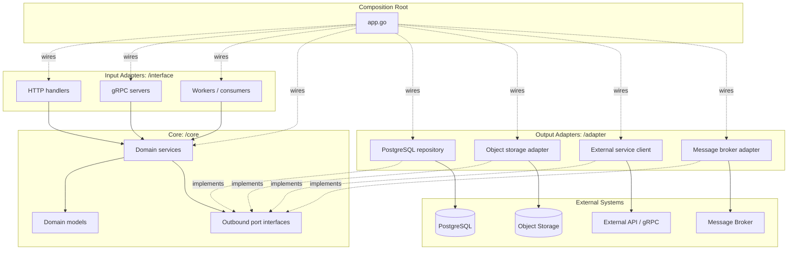

# New Go Arch

# Go Service Architecture

This document defines a reusable Go service architecture based on layered ports-and-adapters design. Transport adapters sit at the edge, business logic lives in `core`, infrastructure adapters implement core-defined interfaces, and one composition root wires the application together.

## Directory Structure

```text
/adapter
  /postgresql
    /entities
      domain_entity.go
    domain_repository.go
  /s3
    object_storage_repository.go
  /external_service
    external_repository.go

/cmd
  /service-name
    main.go
  /data-migrator
    main.go
    properties.yml

/core
  /domain
    /model
      domain_model.go
    repository.go
    service.go
    error.go
    constant.go
    service_test.go
    repository_mock_test.go
    service_mock_test.go

/db
  /migration
    atlas.sum
    YYYYMMDDHHMMSS_change_name.sql
  /data-migrator
    atlas.sum
    YYYYMMDDHHMMSS_seed_name.sql

/interface
  /http
    controller.go
    error_mapping.go
    domain_handler.go
    /dto
      domain_dto.go
      error_dto.go
      success_dto.go
  /grpc
    domain_grpc.go
    domain_mapper.go
    /spec
      domain_service.proto

/library
  middleware.go
  helper.go

app.go
properties.yml
Dockerfile
Makefile
README.md
```

## Layer Responsibilities

### `/cmd`

Contains executable entry points only. The normal service entry point should:


1. Load configuration from `properties.yml`.
2. Create the application config struct.
3. Call `app.Init(...)`.

Do not put dependency wiring or business logic here. That responsibility belongs to `app.go`.

### `app.go`

Application composition root. It owns startup wiring:

* observability setup: logging, tracing, metrics
* database clients, object storage clients, gRPC clients, external API clients
* adapter construction
* core service construction
* HTTP controller construction
* gRPC server registration
* graceful shutdown

This file may know concrete implementations. Core services should not.

### `/interface`

Primary/input adapters. These translate external requests into core service calls.

* `/interface/http`: Echo handlers, route registration, auth middleware, DTO parsing, response/error mapping.
* `/interface/grpc`: gRPC server implementations, protobuf mappers, service registration.
* Other input adapters such as WebSocket, Kafka consumers, or workers can be added when the service actually needs them.

Interface code should not contain business rules beyond request validation, authentication extraction, and response mapping.

### `/core`

Business logic layer. Each domain owns its own package:

* `service.go`: use cases and business rules
* `repository.go`: outbound port interfaces required by the service
* `/model`: domain models and lifecycle/state helpers
* `error.go`: domain errors used by services and mapped by interfaces
* tests and generated mocks close to the domain they cover

Core code depends on interfaces, not concrete adapters. It can orchestrate multiple outbound ports when a use case requires it.

### `/adapter`

Secondary/output adapters. These implement interfaces defined in `core`.

Common adapter examples:

* `adapter/postgresql`: GORM repositories and database entities
* `adapter/identity_provider`: identity, realm, organization, group, account adapters
* `adapter/s3`: object storage adapter
* `adapter/external_service`: outbound gRPC or HTTP client adapter
* `adapter/message_broker`: event publishing adapter

Adapter DTOs/entities should be converted to core models at the adapter boundary.

### `/db`

Database migration and seed data.

* Use `db/migration` for current schema migrations.
* Use `db/data-migrator` for seed/data migration scripts.
* If a legacy `migrations/` directory exists, keep it only for historical compatibility and do not add new migrations there.

### `/library`

Shared helpers that are not domain-specific, such as session middleware, request helpers, or small common utilities. Keep this package small; domain logic belongs in `core`.

## Dependency Direction



The direction is:


1. Interface adapters call core services.
2. Core services call repository/client interfaces defined in `core`.
3. Infrastructure adapters implement those interfaces.
4. `app.go` wires concrete adapters into core services.

## Request Flow Example

```text
HTTP request
  -> interface/http handler
  -> parse DTO and extract session claims
  -> core/domain service method
  -> core validates business rules
  -> core calls outbound repository/client ports
  -> adapter persists data or calls external service
  -> handler maps result or domain error to response
```

For gRPC:

```text
gRPC request
  -> interface/grpc server method
  -> protobuf mapper
  -> core/domain service method
  -> adapter through core port
  -> protobuf response mapper
```

## Configuration

Use a typed application config struct in `app.go`, loaded by the executable in `cmd`. Configuration should include only runtime concerns such as:

* environment and app name
* HTTP/gRPC ports
* trace/log exporters
* database connection
* object storage
* auth/JWKS settings
* external service hosts

Core services should receive already-constructed dependencies, not raw global configuration.

## Testing Guidance

* Unit-test `core` services with mocks for repository/client interfaces.
* Test adapter behavior separately when query mapping, external protocol behavior, or persistence details are non-trivial.
* Keep handler tests focused on transport concerns: parsing, auth extraction, status codes, and error mapping.

## Naming Conventions

* Prefer `/interface/http`, not `/interface/web`, for REST APIs.
* Keep domain models under `/core/<domain>/model`.
* Keep transport DTOs under `/interface/http/dto`.
* Keep database entities under `/adapter/postgresql/entities`.
* Use `library`, not `libary`.
* Use one consistent configuration filename, such as `properties.yml`.

## Implementation Notes

Use these conventions consistently across services:

* `app.go` is the real dependency injection and server startup point.
* `cmd/main.go` is intentionally thin.
* HTTP and gRPC can coexist under `/interface`.
* Core services own lifecycle rules and authorization decisions.
* PostgreSQL, identity providers, object storage, message brokers, and outbound gRPC/HTTP clients are all adapters behind core interfaces.
* Atlas migrations live in `db/migration`; legacy migration directories should not receive new schema work.